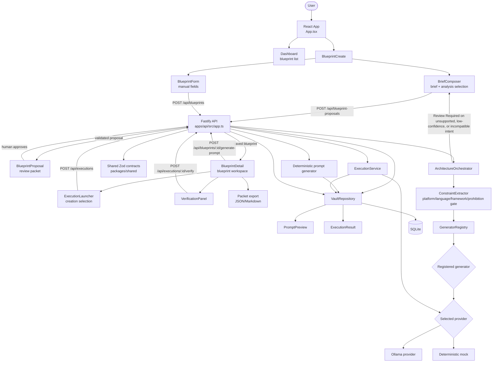
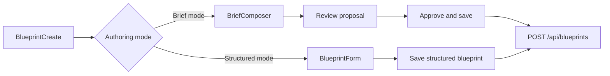
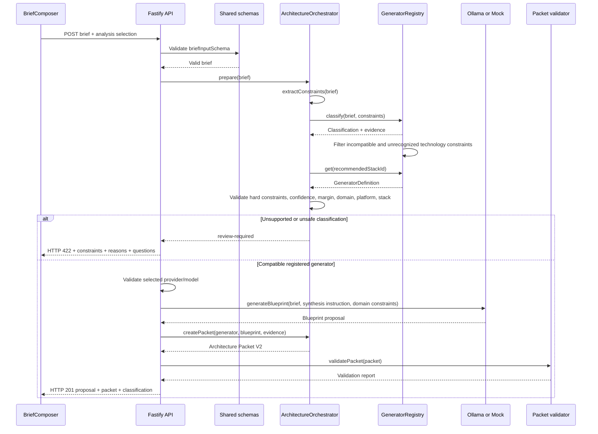
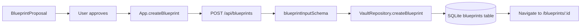
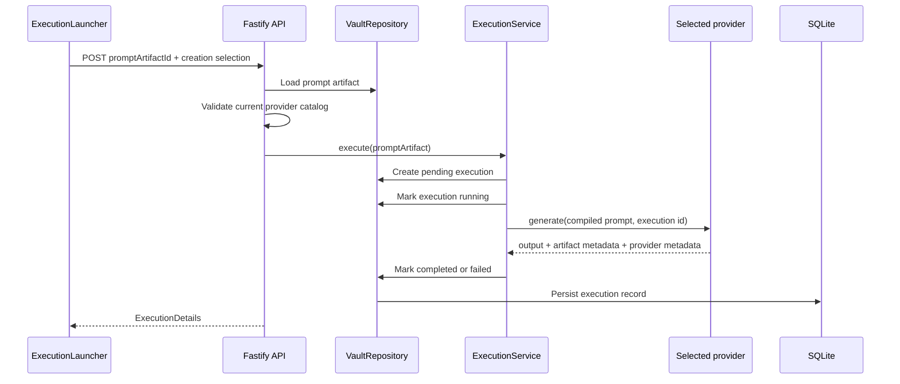
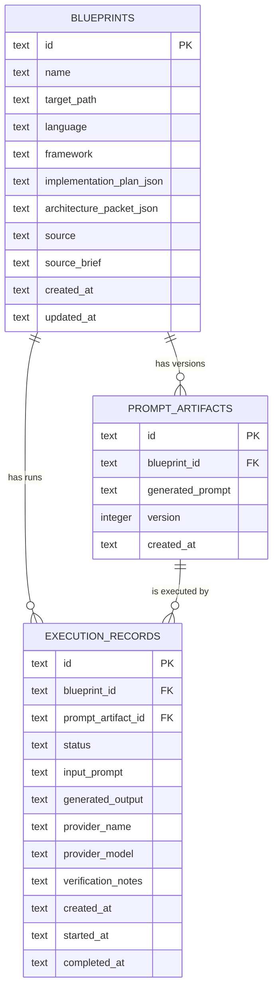

# Vault Architect — End-to-End Workflow

This document describes the workflow currently implemented in the repository: what the user does in the UI, which React component handles it, which API route is called, what validation and orchestration occur, where data is stored, and what the user sees next.

## System at a glance



## 1. Application startup

Entry point: `apps/web/src/App.tsx`

When the React application mounts, it loads three pieces of workspace state:

1. `GET /api/blueprints` loads the blueprint list.
2. `GET /api/providers/status` loads configured provider health and role defaults.
3. `GET /api/providers/models` loads the current Ollama catalog, filters cloud models, and includes the deterministic mock option.

The application stores the blueprint list, provider status, catalog, and catalog loading state at the page/application level. Catalog refresh is manual. The refresh button calls the same catalog endpoint, keeps the existing selection visible, and updates the catalog when the request succeeds.

## 2. Dashboard and navigation

Component: `apps/web/src/pages/Dashboard.tsx`

The dashboard displays:

- the blueprint count;
- packet count based on implementation plans;
- provider availability;
- the saved blueprint list;
- navigation to an existing blueprint;
- navigation to `/blueprints/new`.

The browser uses hash-based navigation. `App.tsx` selects the rendered page from the current hash path.

## 3. New blueprint workflow

Component: `apps/web/src/pages/BlueprintCreate.tsx`

The new-blueprint page has two paths:



### 3.1 Brief mode: analysis selection

Component: `apps/web/src/components/BriefComposer.tsx`

The user enters a natural-language brief and chooses an analysis provider/model through `ProviderRoleControl`.

The UI prevents submission when:

- the brief is empty;
- the selected Ollama model is absent from the current catalog;
- the selected model is marked unavailable.

The deterministic mock is an explicit selectable option. It does not bypass architecture classification.

Request:

```http
POST /api/blueprint-proposals
Content-Type: application/json
```

```json
{
  "brief": "Build a Swift SpriteKit mobile physics game with collision handling.",
  "analysis": {
    "provider": "mock",
    "model": "deterministic-local"
  }
}
```

## 4. Proposal API workflow

Route: `apps/api/src/app.ts` — `POST /api/blueprint-proposals`

The server performs these steps in order:



### 4.1 Classification and registry routing

The registry is the sole routing authority. The current registered definitions are:

| Registry id | Domain | Platform | Required architecture components |
| --- | --- | --- | --- |
| `swift-spritekit` | `mobile-physics` | Mobile | `PhysicsController`, `SceneLayer`, `EntityNode`, `InputController`, `PersistenceManager` |
| `python-flet` | `desktop-ui` | Desktop | `ViewLayer`, `EventController`, `StateModel`, `ServiceAdapter`, `PersistenceManager` |
| `react-typescript` | `web-dashboard` | Web | `ViewLayer`, `StateController`, `ApiAdapter`, `AccessibilityLayer`, `PersistenceManager` |

The classifier ranks the registered generator definitions using exact token/phrase signals and conflict rules. The current safety rules are:

- confidence must be at least `0.78`;
- semantic integrity must be at least `0.80`;
- the winning generator must beat the next alternative by at least `0.10`;
- the recommended stack must exist in the registry;
- classification stack, domain, and platform must match the selected generator.

Broad language terms and framework terms are matched as separate tokens. For example, `SwiftUI` does not match the `Swift` token, and it is an explicit conflict for the registered SpriteKit generator. There is no implicit React/Tailwind fallback.

### 4.2 Review Required path

When classification is unsupported, too uncertain, or incompatible, the API returns HTTP `422`:

```json
{
  "status": "review-required",
  "classification": {},
  "reasons": ["Classification confidence is below the safety threshold."],
  "availableGenerators": []
}
```

The UI displays the reasons and available registered generators, keeps the brief editable, and does not call the provider or save a blueprint.

### 4.3 Provider generation path

Only after classification succeeds does the API validate the analysis selection against the current Ollama catalog. It then passes the validated brief, first-principles synthesis instruction, generator id, and domain constraint context to the selected provider. The registry contributes constraints and required components; it does not inject a complete stack template. Providers reject blueprint synthesis when the generator id and synthesis context are absent or inconsistent.

- `OllamaAiProvider` sends the bounded brief and generator-specific instruction to Ollama.
- `MockAiProvider` returns deterministic stack-specific proposal data for the registered generator.
- Both providers return the normalized proposal contract.

The API then creates Architecture Packet V2 and validates its language, framework, stack, domain, platform, required components, and layer references before returning the proposal.

## 5. Proposal review and approval

Component: `apps/web/src/components/BlueprintProposal.tsx`

The proposal review surface displays:

- blueprint name and description;
- selected provider metadata;
- classified domain and stack;
- confidence and classifier version;
- dynamic packet components;
- architecture boundary and core behavior;
- target path, language, and framework;
- constraints;
- implementation plan;
- files to touch;
- acceptance criteria;
- warnings and assumptions.

Nothing is saved when the proposal is merely generated. The user must select **Approve & save blueprint**.

Approval flow:



The blueprint is stored with the existing Phase 1/2 fields plus `architecture_packet_json`, source metadata, and source brief.

## 6. Manual structured blueprint path

Component: `apps/web/src/components/BlueprintForm.tsx`

The manual form bypasses AI proposal generation but does not bypass API schema validation. It sends the blueprint fields directly to `POST /api/blueprints`.

This path is intentionally compatible with legacy and human-authored React records. It does not automatically invent a classification or generator packet. Domain-aware packet generation applies to the brief proposal route.

## 7. Blueprint detail loading

Component: `apps/web/src/pages/BlueprintDetail.tsx`

When the detail page opens, it requests:

1. `GET /api/blueprints/:id`
2. `GET /api/blueprints/:id/executions`
3. `GET /api/blueprints/:id/prompt` when a prompt exists
4. `GET /api/executions/:id` for the newest execution when one exists

The page renders the source blueprint, Architecture Packet V2, prompt artifact, execution launcher, execution result, verification panel, and execution timeline.

## 8. Prompt compilation

Component: `BlueprintDetail` → `api.generatePrompt(id)`

Request:

```http
POST /api/blueprints/:id/generate-prompt
```

Server steps:

1. Load the approved blueprint from SQLite.
2. Generate a deterministic Codex prompt from the blueprint fields.
3. Create a versioned prompt artifact in `prompt_artifacts`.
4. Create a pending execution record linked to the blueprint and prompt artifact.
5. Return both records to the UI.

The prompt compiler is deterministic and does not call Ollama.

## 9. Execution workflow

Component: `apps/web/src/components/ExecutionLauncher.tsx`

The user chooses a creation provider/model independently from the analysis selection. The UI blocks launch when the selected Ollama model is unavailable.

Request:

```http
POST /api/executions
Content-Type: application/json
```

```json
{
  "promptArtifactId": "prompt-id",
  "creation": {
    "provider": "mock",
    "model": "deterministic-local"
  }
}
```

Server steps:



Execution records retain:

- blueprint id;
- prompt artifact id;
- input prompt;
- generated output;
- provider name and model;
- fallback indicator and provider message;
- duration;
- artifact type and location;
- lifecycle status and timestamps;
- verification notes.

## 10. Human verification

Component: `apps/web/src/components/VerificationPanel.tsx`

After execution, the user enters verification notes. The UI sends:

```http
POST /api/executions/:id/verify
Content-Type: application/json
```

```json
{
  "verificationNotes": "Reviewed the generated artifact against the approved packet."
}
```

The API validates the note and updates `verification_notes` on the execution record. The detail page refreshes the execution result and timeline state.

## 11. Export workflow

Component: `apps/web/src/pages/BlueprintDetail.tsx` → `apps/web/src/lib/packet-export.ts`

The **Export Packet** action does not call the API. It assembles the currently loaded blueprint, prompt, execution history, selected execution, provider metadata, and verification evidence into the Phase 1 packet export format and downloads it locally.

The Phase 4 Architecture Packet remains embedded in the blueprint portion of that export. Existing export behavior is preserved.

## 12. Persistence map



## 13. Failure and recovery behavior

| Failure | Where detected | UI behavior | Persistence behavior |
| --- | --- | --- | --- |
| API unavailable at startup | Web API client | Workspace error | No write |
| Catalog refresh fails | `App.refreshCatalog` | Existing catalog/selection remains | No write |
| Selected model unavailable | UI and API catalog validation | Disable action or show recoverable error | No generation |
| Brief unsupported or ambiguous | `GeneratorRegistry` | Show `Review Required` | No provider call or blueprint save |
| Classification/generator mismatch | `ArchitectureOrchestrator` | Show review-required response | No provider call or blueprint save |
| Provider returns invalid proposal | Provider adapter/schema boundary | Show proposal-generation error | No approved blueprint save |
| Packet structure fails validation | Generator packet validator | Show validation failure | No approved blueprint save |
| Prompt compilation fails | Prompt route | Show retryable compile error | Existing records remain unchanged |
| Execution provider fails | `ExecutionService` | Show failed execution evidence | Failed execution is retained |
| Verification save fails | Verification route | Show retryable verification error | Existing execution remains |

## 14. Current logic boundaries to inspect when debugging

Use this order when tracing a problem:

1. `apps/web/src/App.tsx` — route and workspace initialization.
2. `apps/web/src/components/BriefComposer.tsx` — brief submission, analysis selection, and Review Required rendering.
3. `apps/web/src/lib/api.ts` — request payloads and API error details.
4. `apps/api/src/app.ts` — route parsing, provider validation, orchestration, packet creation, and response status.
5. `apps/api/src/services/architecture-orchestrator.ts` — classification-to-generator gate.
6. `packages/prompts/src/registry.ts` — registered generators, signal scoring, packet construction, and validation.
7. `apps/api/src/providers/ollama-provider.ts` and `mock-provider.ts` — provider-specific normalization.
8. `apps/api/src/repository.ts` — SQLite writes, migrations, and record mapping.
9. `apps/api/src/services/execution-service.ts` — execution lifecycle transitions.
10. `apps/web/src/pages/BlueprintDetail.tsx` — prompt, execution, verification, and export state updates.

## 15. Verification commands

```text
npm test
npm run typecheck
npm run build
npm run seed:demo
```

This document describes the current implementation. If behavior changes, update `INFO.md`, the relevant architecture document, and `BUILD_LOG.md` in the same workstream.
